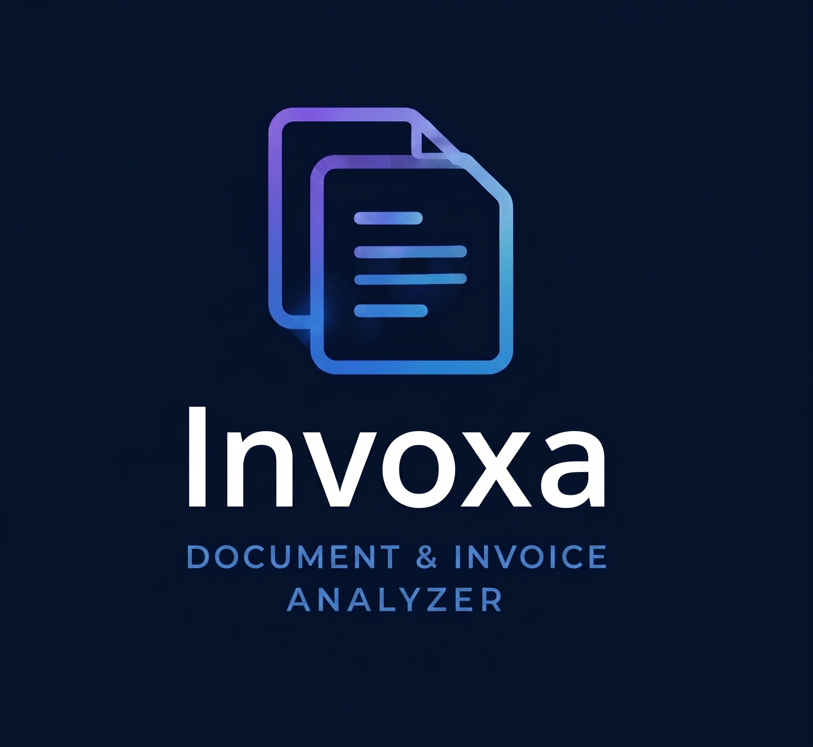

# Invoxa - Document & Invoice Analyzer

Invoxa is a production-minded B2B document workflow for uploading invoices, extracting
structured financial data, reviewing explainable AI Analysis findings, and exporting
auditable records. It combines a FastAPI modular monolith, a durable Redis-backed worker,
PostgreSQL, and a responsive React interface without requiring a paid AI or LLM service.



## Capabilities

- Email/password authentication, password recovery, Google OAuth/OIDC, RBAC, and ownership isolation
- Owner-scoped PDF, JPG, JPEG, and PNG upload, preview, search, filters, sorting, and pagination
- PDF text extraction and Tesseract OCR fallback with file, page, pixel, size, and timeout limits
- Invoice fields, line items, extraction provenance, confidence, and deterministic validation
- Durable Redis processing with in-flight recovery, queue reconciliation, reprocessing, and safe failure states
- Explainable AI Analysis with arithmetic, duplicate, missing-field, confidence, date, tax, and statistical amount findings
- Finding acknowledgement, resolution, reopening, evidence, severity, status, and source-document drill-down
- Server-side KPIs, trends, multi-currency-safe totals, and financial/AI/processing reports
- CSV, XLSX, and JSON document/report exports with spreadsheet-injection protection
- Responsive commercial UI, health/readiness checks, structured logs, rate limiting, and Docker deployment assets

## Architecture

```text
Browser (React/TypeScript)
        |
        v
FastAPI API ------ PostgreSQL
    |                  |
    +---- Redis queue -+---- Worker ---- PDF extraction / Tesseract OCR
                                      |
                                      +---- validation + AI Analysis
```

The API is the authentication, authorization, query, analytics, and reporting boundary.
Uploads are persisted before a queue job is published. The worker recovers abandoned jobs and
reconciles queued database records. AI Analysis is isolated from the extraction transaction so
an optional analysis failure does not destroy usable OCR results or leave processing stuck.

See [Architecture](docs/ARCHITECTURE.md), [Deployment](docs/DEPLOYMENT.md), and the
[User guide](docs/USER_GUIDE.md) for detailed design and workflows.

## Technology stack

| Layer | Technology |
| --- | --- |
| Web | React, TypeScript, Vite, NGINX production runtime |
| API | Python 3.12, FastAPI, Pydantic, SQLAlchemy |
| Data | PostgreSQL 16, Alembic |
| Queue | Redis 7, durable list/in-flight workflow |
| Documents | pypdf, pypdfium2, Pillow, Tesseract OCR |
| Exports | Python CSV/JSON, openpyxl |
| Quality | pytest, Vitest, Ruff, Pyright, ESLint, Prettier |

## Repository structure

```text
apps/api/app/                 API, security, extraction, analysis, reports, and worker code
apps/api/migrations/          Ordered Alembic migrations
apps/api/tests/               Unit, security, integration, and regression tests
apps/web/src/                 React application and frontend tests
apps/web/public/              Versioned public brand assets
docs/                         Architecture, deployment, and product documentation
docker-compose.yml            Local/reference multi-service stack
docker-compose.production.yml Production hardening override
```

## Prerequisites

- Docker Desktop or Docker Engine with Compose v2
- Node.js 20+ and npm 10+ for local web development
- Python 3.12+ for local API development
- Tesseract with English language data when running the worker outside Docker

## Quick start with Docker

```powershell
Copy-Item .env.example .env
docker compose up --build -d
docker compose ps
```

Replace local placeholders in `.env` before starting. Open:

- Web: `http://localhost:5173`
- API health: `http://localhost:8000/health`
- Dependency readiness: `http://localhost:8000/health/ready`

The one-shot `migrate` service applies Alembic migrations before API/worker startup. Stopping
with `docker compose down` preserves named volumes; do not add `--volumes` unless deletion is
explicitly intended.

## Local development

Start dependencies:

```powershell
docker compose up -d postgres redis
```

Run API and worker in separate terminals:

```powershell
python -m venv .venv
.\.venv\Scripts\Activate.ps1
python -m pip install -e ".[dev]"
alembic upgrade head
uvicorn apps.api.app.main:app --reload --port 8000
```

```powershell
.\.venv\Scripts\Activate.ps1
python -m apps.api.app.worker
```

Run the web app:

```powershell
Set-Location apps\web
npm ci
npm run dev
```

## Configuration

Copy `.env.example` to `.env`; `.env` is ignored by Git. Configuration groups include:

- PostgreSQL: `POSTGRES_*`, `DATABASE_URL`
- Redis/queue: `REDIS_URL`, reconciliation interval
- Authentication: `AUTH_SECRET_KEY`, token lifetime, rate limits
- Routing: `VITE_API_BASE_URL`, `FRONTEND_BASE_URL`, `CORS_ORIGINS`, `ALLOWED_HOSTS`
- Password recovery: SMTP and development-only outbox settings
- Google Sign-In: OAuth client ID, secret, and exact callback URI
- OCR safety: page, pixel, upload, and timeout limits

Never commit `.env`, credential JSON, tokens, dumps, uploaded documents, or password-reset outbox
content. Production values and Google setup are documented in [Deployment](docs/DEPLOYMENT.md).

## Quality checks

From the repository root:

```powershell
python -m pytest
python -m ruff check apps/api
python -m ruff format --check apps/api
python -m pyright
```

From `apps/web`:

```powershell
npm run test:run
npm run lint
npm run format:check
npm run build
npm audit --omit=dev
```

Docker verification:

```powershell
docker compose config --quiet
docker compose -f docker-compose.yml -f docker-compose.production.yml config --quiet
$env:RUN_DOCKER_INTEGRATION="1"
python -m pytest apps/api/tests/test_docker_regression.py
```

The Docker regression suite uses disposable application records for PDF/JPG/PNG, rapid uploads,
AI Analysis, reports, exports, and cross-user denial. It does not reset volumes or the database.

## Production

Invoxa expects HTTPS termination at a trusted reverse proxy or hosting platform. PostgreSQL and
Redis remain private. The production override binds web/API to loopback and removes published
database/cache ports:

```powershell
docker compose --env-file .env.production `
  -f docker-compose.yml -f docker-compose.production.yml up -d --build
```

Production secrets and domain-specific OAuth values are deployment inputs, not repository
content. A domain, cloud purchase, paid monitoring, or paid AI API is not required to verify the
codebase.

## Honest scope and limitations

- English Tesseract data is installed; additional OCR languages require image customization.
- Named-volume storage is single-host; horizontal scaling requires shared object/file storage.
- Currency totals remain separate; Invoxa does not perform FX conversion.
- AI Analysis assists review and does not claim fraud detection, legal advice, or tax compliance.
- PDF reports are deferred; report exports are CSV, XLSX, and JSON.
- SMTP and production Google credentials are required only for those production integrations.
- Backups, TLS, monitoring, and infrastructure malware scanning are operator responsibilities.

## Documentation

- [Architecture and engineering decisions](docs/ARCHITECTURE.md)
- [Production deployment and operations](docs/DEPLOYMENT.md)
- [Product and user workflows](docs/USER_GUIDE.md)
